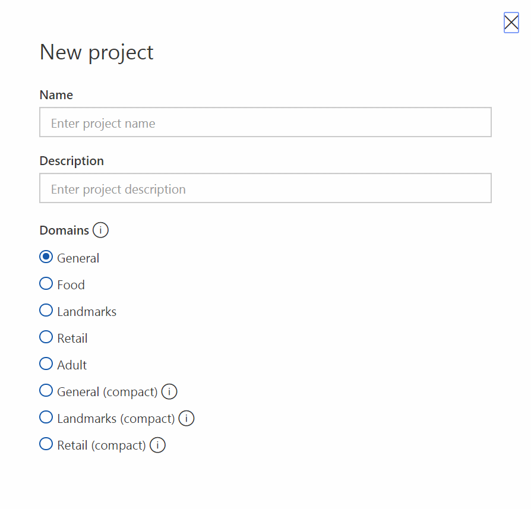
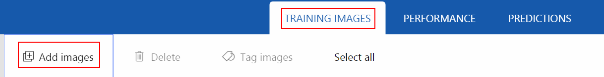
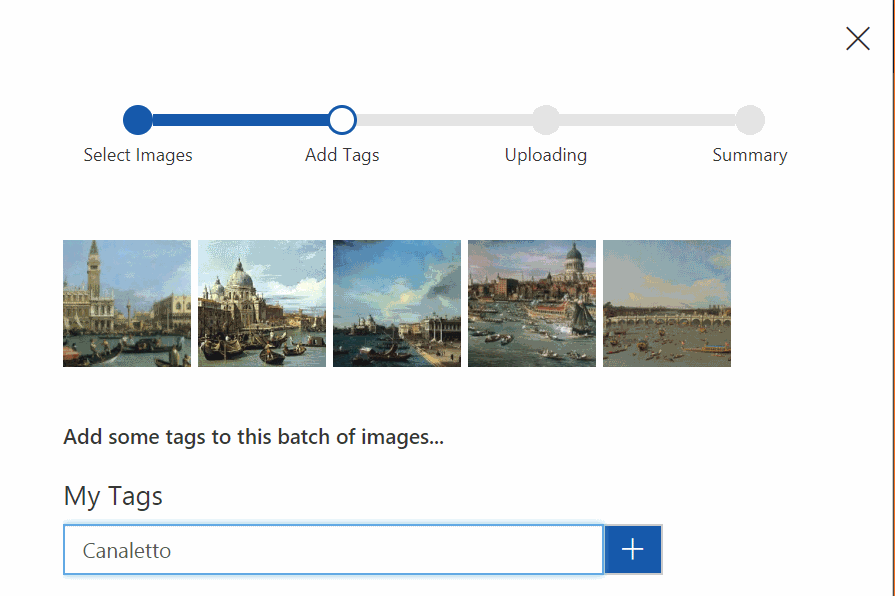
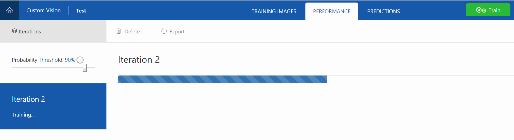
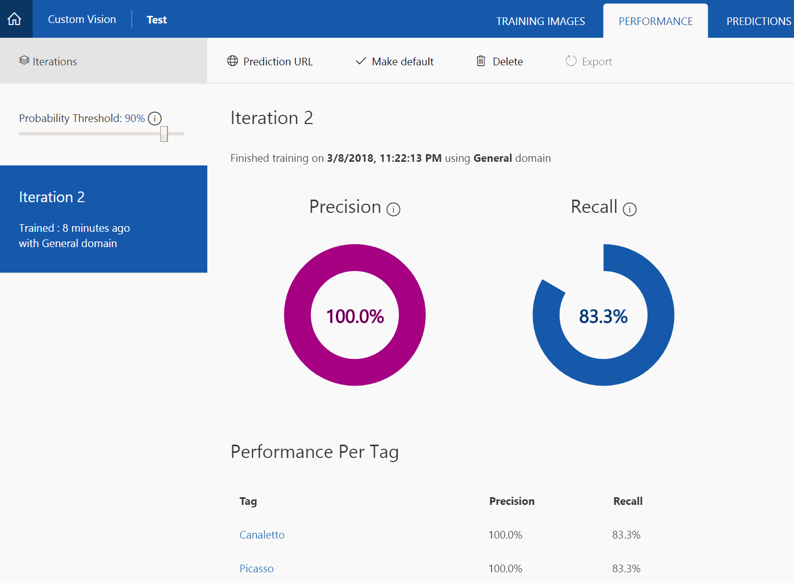
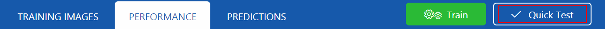
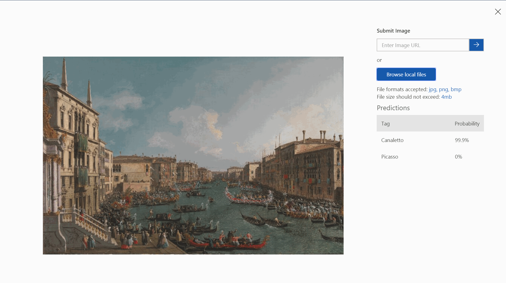
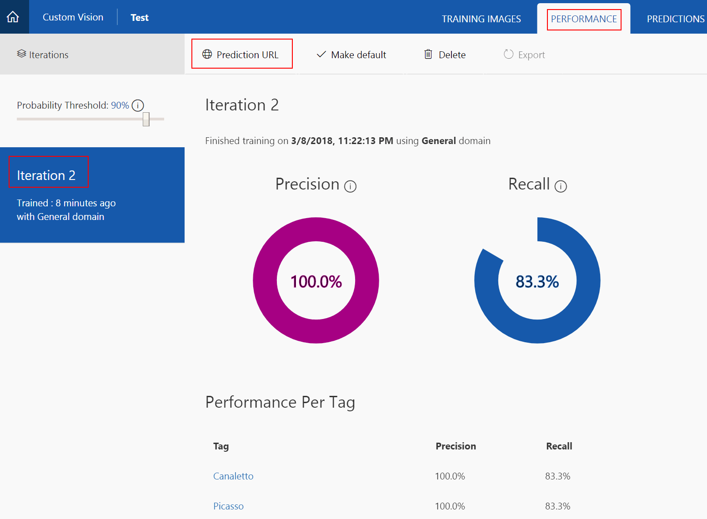
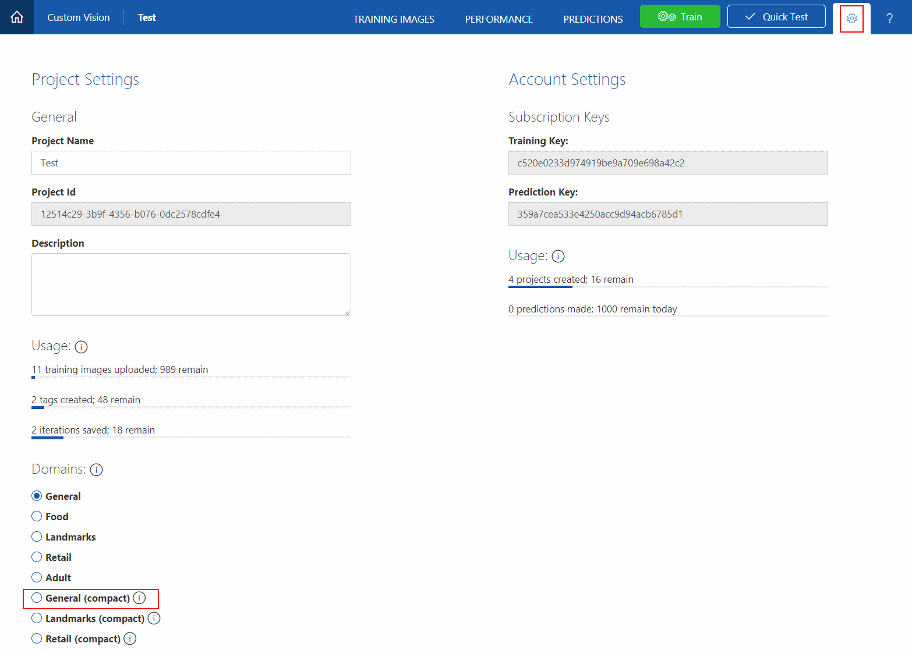
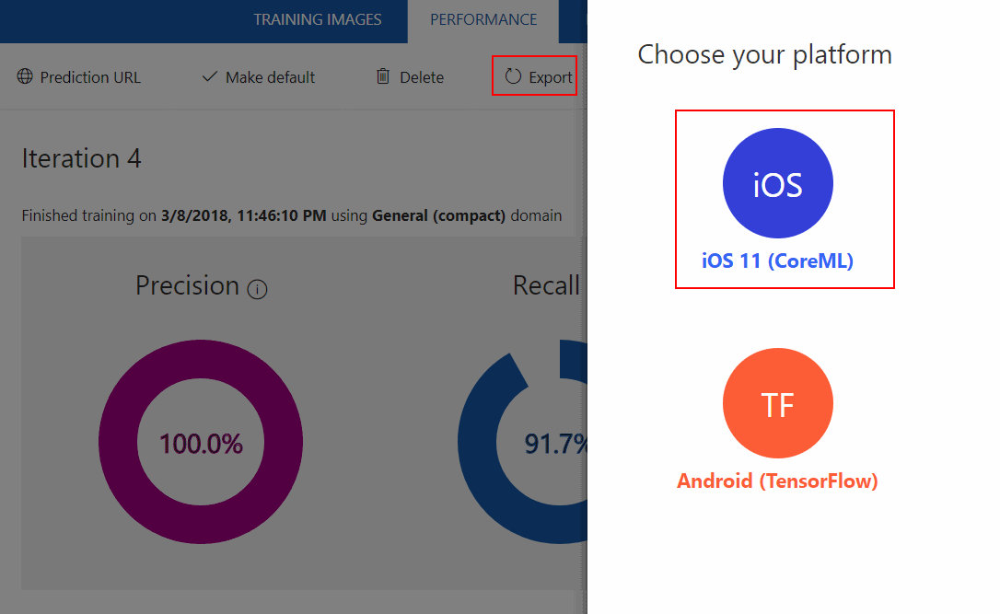

# Microsoft Custom Vision Service

Custom Vision Service is a tool for building custom image classifiers, and for making them better over time. For example, if you want a tool that could identify images of "Daisies", "Daffodils", and "Dahlias", you could train a classifier to do that. You do so by providing Custom Vision Service with images for each tag you want to recognize.

Custom Vision Service works best when the item you are trying to classify is prominent in your image. Custom Vision Service does "image classification" but not yet "object detection." This means that Custom Vision Service identifies whether an image is of a particular object, but not where that object is within the image.

Very few images are required to create a classifier - 30 images per class is enough to start your prototype. The methods Custom Vision Service uses are robust to differences, which allows you to start prototyping with so little data. However, this means Custom Vision Service is not well suited to scenarios where you want to detect very subtle differences (for example, minor cracks or dents in quality assurance scenarios.)

More information is available at Custom Vision Service [documentation page](https://docs.microsoft.com/en-gb/azure/cognitive-services/custom-vision-service/home).

## Prerequisites

To build a classifier you need:

* A valid [Microsoft account](https://account.microsoft.com/account) or an Azure Active Directory OrgID ("work or school account") to be able to sign in to access [Custom Vision Service](https://customvision.ai/) page.
* A number of images to train and test your classifier

Note 1: If you are planning to follow the exercise and use provided images,please look at ```Artworks images``` folder of this repository. If you are building a classifier based on your own images, please prepare 5-10 samples for training and 2-5 images for testing purposes. Please check ```README.md``` file within that folder for more detail.

Note 2: (Not required for the workshop) It is generally recomended to have at least 30 images per image class ("tag").

## Create and train your custom image classifier

### Build a classifier

Custom Vision Service can be found on the [Custom Vision page](https://customvision.ai/).

After you sign in to Custom Vision Service, you are presented with a list of projects.

Step 1.To create your first project, select **New Project**.

Step 2.If this is your first project, you are asked to agree to the Terms of Service. Select the check box, and then select the **I agree** button. The **New project** dialog box appears.

Step 3. Enter a name and a description for this project. Then select one domain. There are several domains available. Each one optimizes the classifier for specific types of images.

For the purposes of this tutotial we can use **General** or **General (Compact)** (if you are planning to test your model on a mobile application in Part 2)



Step 4. Add images to train your classifier.

Add some images to train your classifier. Let's say you want a classifier to distinguish between dogs and ponies. You would upload and tag at least 30 images of dogs and 30 images of ponies. You can use images provided in ```Artworks images``` in this repository under ```1. Picasso\Train``` and ```1. Canaletto\Train``` folders.

Generally speaking you'd want to upload images with different camera angles, lighting, background, types, styles, groups, sizes, and so on. Use a variety of photo types to ensure that your classifier is not biased and can generalize well.

*Note:* Custom Vision Service accepts training images in .jpg, .png, and .bmp format, up to 6 MB per image. (Prediction images can be up to 4 MB per image.) We recommend that images be 256 pixels on the shortest edge. Any images shorter than 256 pixels on the shortest edge are scaled up by Custom Vision Service.

a. Select Add images.



b. Browse to the location of your training images.

c. Select the images for your first tag.

d. Select **Open** to open the selected images.

e. Assign tags: Type in the tag you want to assign. For artworks tutorial we will use only 2 tags: **Picasso** and **Canaletto**



f. When you are done adding tags, select **Upload [number] files**. If you have a large number of images or a slow Internet connection, the upload might take some time.

g. After the files have uploaded, select **Done**.

h. To load more images with a different set of tags, return to step a.

Step 5.Train your classifier

After your images are uploaded, you are ready to train your classifier. All you have to do is select the Train button.


It should only take a few minutes to train your classifier.



Step 6.Evaluate your classifier

The precision and recall indicators tell you how good your classifier is, based on automatic testing. Custom Vision Service uses the images that you submitted for training to calculate these numbers, by using a process called k-fold cross validation.



The classifier uses all the images to create a model that identifies each tag. To test the quality of the model, the classifier then tries each image on its model to see what the model finds.

The qualities of the classifier results are displayed.

|Term|Definition|
|---|---|
|Precision|When you classify an image, how likely is your classifier to correctly classify the image? Out of all images that are used to train the classifier (dogs and ponies), what percent did the model get correct? Ninety-nine correct tags out of 100 images gives a precision of 99%.|
|Recall|Out of all images that should have been classified correctly, how many did your classifier identify correctly? A recall of 100% means that if there are 38 dog images in the images that were used to train the classifier, the classifier found 38 dogs.|

*Note:* If you want to know more about building your custom image classifier using Custom Vision service please read the [documentation](https://docs.microsoft.com/en-gb/azure/cognitive-services/custom-vision-service/getting-started-build-a-classifier#getting-started-build-a-classifier).

## Test your custom image classifier

After you train your model, you can quickly test it using a locally stored image or an online image. The test uses the most recently trained iteration.

Step 1. Click **Quick Test** on the right of the top menu bar. This action opens a window labeled **Quick Test**.



Step 2. In the **Quick Test** window, click in the **Submit Image** field and click the **Browse local files** button and select a local image file.



The image you select appears in the middle of the page. Then the results appear below the image in the form of a table with two columns, labeled **Tags** and **Confidence**. After you view the results, you may close the **Quick Test** window.

You can now add this test image to your model and then retrain your model.

### Add a test image and retrain your model

You can follow the steps below to add to your model an image that you have submitted for a quick test and to then retrain the model.

a. Click the **PREDICTIONS** tab on the top menu bar.

b. Click the image you used for the quick test. A new window appears, with the image in the center.

c. In the new window, assign the correct tag to the image from the **My Tags** drop-down list. If you don't see the appropriate tag in the drop-down list, you can type in a new tag and then click the **+** sign to the right of the **My Tags** field.

d. Click the **Save and close** button at the bottom of the window.

e. Click the **Train** button in the top menu bar.

## Generate and test your custom classifier's prediction API URL

After you train your model, you can obtain a URL that you can use to test images programmatically.

Obtain the prediction endpoint URL for a specific iteration:

Step 1. Click the "PERFORMANCE" tab, which is shown inside a red rectangle in the following image.

Step 2. In the left pane, click on the iteration you want to use for testing images.

Step 3. In the upper part of the screen, click "Prediction URL", which is also shown in a red rectangle in the following image.



### Export your classifier model to mobile

Custom Vision Service allows classifiers to be exported to run offline. You can embed your exported classifier into an application and run it locally on a device for real-time classification. Currently the supported are export to Tensorflow for Android devices or the CoreML format for iOS11.

Custom Vision Service only exports “compact”domains. The models generated by compact domains are optimized for the constraints of real-time classification on mobile devices.

When we created our classifier you should have selected **General (compact)** domain. Otherwise, Open the settings page for this classifier by clicking on the gear-shaped icon at the top right. From within the setting page, select a compact domain and then hit Save Changes.



3.After changing your domain, you will need to hit the Train button to train your project.

Once your project has finished training, you can export your model. To do so:

1. Go to the **Performance** tab and select the iteration you want to export

2. If this iteration used a compact domain, an export button appears at the top bar.

3. Click on **Export**, then select your format.



4. Click on **Export** and then **Download** to download your model.

5. We will use this model in Part 2 - iOS app project.