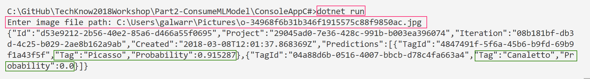

## Overview 

We can use a simple console app to test our custom image classifier. 

For this tutorial I'm going to use .NET Core SDK (can be run on Windows, Linux and macOS), and utilise VS Code IDE.

## Prerequisites

1. Install [Visual Studio Code](https://code.visualstudio.com/) - a cross-platform IDE that works on Windows, Linux and macOS.
2. Install the [.NET Core SDK](https://www.microsoft.com/net/download/core).
3. Install the [C# extension](https://marketplace.visualstudio.com/items?itemName=ms-vscode.csharp) for Visual Studio Code. For more information about how to install extensions on Visual Studio Code, see [VS Code Extension Marketplace](https://code.visualstudio.com/docs/editor/extension-gallery).

## Initialise Console App

Step 1. Open a project:

* Open Visual Studio Code.
* Click on the Explorer icon on the left menu and then click Open Folder.
* Select File > Open Folder from the main menu to open *Part2-ConsumeMLModel\ConsoleAppC#* folder and click Select Folder. 

Step 2. Initialize a C# project:
* Open the Integrated Terminal from Visual Studio Code by selecting View > Integrated Terminal from the main menu.
* In the terminal window, type ```dotnet new console```

This command creates a ```Program.cs``` file in your folder with a simple "Hello World" program already written, along with a C# project file named ```ConsoleAppC#.csproj```

Step 3. Run the "Hello World" program by typing  ```dotnet run``` in the terminal window

## Connect to Custom Vision API

Open ```Program.cs``` file

Step 1. Update the imports section

```
using System;
using System.IO;
using System.Net.Http;
using System.Net.Http.Headers;
using System.Threading.Tasks;
```

Step 2. Update Main() method

```cs
static void Main()
{
    Console.Write("Enter image file path: ");
    string imageFilePath = Console.ReadLine();

    MakePredictionRequest(imageFilePath).Wait();

    Console.WriteLine("\n\n\nHit ENTER to exit...");
    Console.ReadLine();
}
```

Add the methods below:
```cs
static byte[] GetImageAsByteArray(string imageFilePath)
{
    FileStream fileStream = new FileStream(imageFilePath, FileMode.Open, FileAccess.Read);
    BinaryReader binaryReader = new BinaryReader(fileStream);
    return binaryReader.ReadBytes((int)fileStream.Length);
}

static async Task MakePredictionRequest(string imageFilePath)
{
    var client = new HttpClient();

     client.DefaultRequestHeaders.Add("Prediction-Key", "CHANGE TO: Your custom service PredictionKey");

    // Prediction URL - replace this example URL with your valid prediction URL.
    string url = "CHANGE TO: Your custom vision service's prediction URL";

    HttpResponseMessage response;

    // Request body. Try this sample with a locally stored image.
    byte[] byteData = GetImageAsByteArray(imageFilePath);

    using (var content = new ByteArrayContent(byteData))
    {
        content.Headers.ContentType = new MediaTypeHeaderValue("application/octet-stream");
        response = await client.PostAsync(url, content);
        Console.WriteLine(await response.Content.ReadAsStringAsync());
    }
}
```
Save file and in the terminal window, run ```dotnet run``` to test our updated console application. The application will request for a file path to the test image. Once that's given, the application will call Prediction API URL and should respond with predictions about the image.

A sample response provided in the screenshot below


