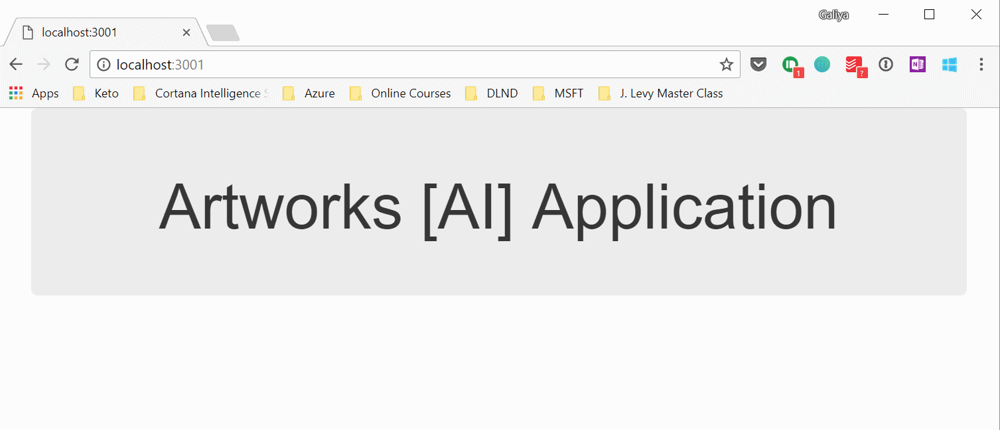
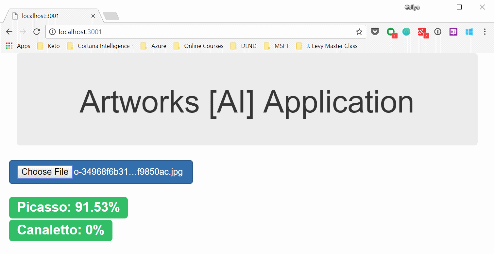

This part of the tutorial introduces a Single Page Application (based on node.js) that can consume Custom Vision models to predict an image class for a given user image. 

*Pre-requisites*: You need to have node environment installed on your machine. you don't need to have knowledge of node.js. Only basic understanding of html / javascript is required for this exercise. 

Step 1. Open terminal and get to the root of this folder

```cd Part2-ConsumeMLModel\WebAppNodejs```

In the terminal window run the command below to install required node modules and libraries:

```npm install```

This will prepare our Single Page App and an Express webserver. 

Step 2. In the terminal run the command below to start the web server:

```npm start```

Step 3. Open a browser and navigate to the URL on a localhost: [http://localhost:3001](http://localhost:3001)

You should see a dumb sigle page application with a title as shown below.



Step 4. Now open index.html file in your IDE (VS Code or others), or open it in text editor and a few changes that will allow us to connect our application page to the Custom Vision service through Prediction API URL. That will give user ability to upload an image file for classification, and the user would be able to see the results of the prediction on the page.  

1. Modify html file to add controls to upload file at the bottom of the <body> tag:
```html
<div id="fileUpload" class="row">
    <form>
        <input type="file" onchange="readImage(this)" class="btn btn-primary btn-lg" />
    </form>  
</div>
<div class="row">
    <div id="predictions"></div>    
</div>
```

2. Modify index.html to add a new script that will wrap up a call to a Prediction API. For the script to work you would require Prediction URL and Prediction Key that can be obtained from the Custom Vision Service page (see **"CHANGE TO:"** lines).

```javascript
<script>

    function precisionRound(number, precision) {
        var factor = Math.pow(10, precision);
        return Math.round(number * factor) / factor;
    }


    function readImage(element) {
    var file = element.files[0];
    var reader = new FileReader();
    reader.onloadend = function() {
    $.ajax({

      url:"CHANGE TO: <Custom Vision Model Prediction URL>",
      data: reader.result,
      processData: false,
      contentType: "application/octet-streama",
      headers: {
        'Prediction-key': "CHANGE TO: <PredictionKey>"
      },
      type: 'POST',
      success: function(response) {
        var result = response["Predictions"];
        result.forEach(element => {
          $( "#predictions" ).append('<div><h1><span class="label label-success label-bs">' + element.Tag + ": " + precisionRound(element.Probability, 4)*100 + '%' + '</span></h1></div>');
        });
      },
      error: function(error) {
        alert('error: ' + error);
      }
    });
  }
  reader.readAsArrayBuffer(file);
}
</script>
```

Step 5. Now if you reload the page (http://localhost:3001) you should be able to test your images against your custom model in Custom Vision service, as well as you should see the predictions at the bottom of the page (as seen on the example below):




Note: if you are having any troubles please look at the example file named ```index.solution.html``` 