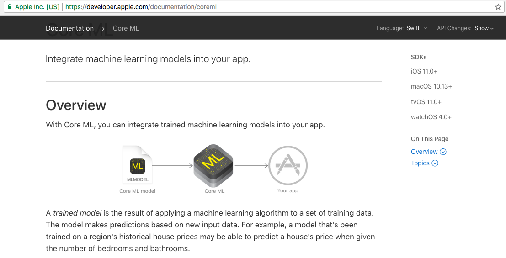
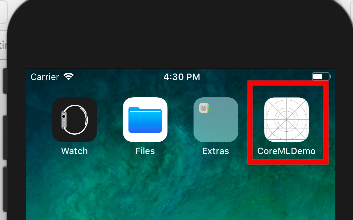
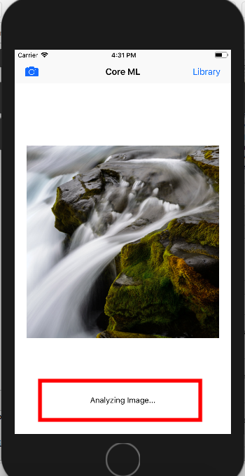
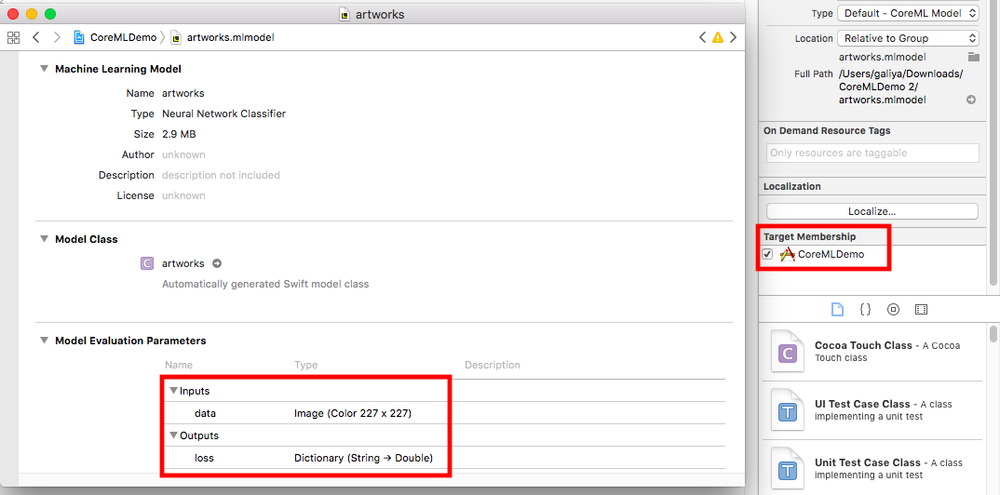
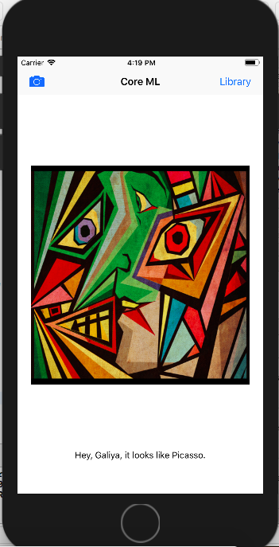

#  iOS App demo

## Prerequisites
* To be able to follow this part of the tutorial you should be using MacOS with XCode v9 installed.
* In this application we will be using an exported version of your Custom vision model (created in Part1). If you don't have that you can use  ```artworks.mlmodel``` provided under ```Artworks CoreML model``` folder within this GitHub repository.

## What is CoreML?



It's very important to note that "Core ML is optimized for on-device performance, which minimizes memory footprint and power consumption. Running strictly on the device ensures the privacy of user data and guarantees that your app remains functional and responsive when a network connection is unavailable", hence we would be able to see that at the end of this tutorial we should be able to use Custom Vision model without requiring any internet access, as the classification task will be done completely on-device. 

To find more information on CoreML, including format documentations, model samples, etc., please use [Apple Developer Documentation](https://developer.apple.com/documentation/coreml)

## Load Image Recognition Application sample

Note: The sample used for this tutorial has been created by Sai Kambampati (Copyright © 2017 AppCoda). You can find more information at this blog ["Introduction to Core ML: Building a Simple Image Recognition App"](https://www.appcoda.com/coreml-introduction/). It is only used for training purposes. 

Step 1. Open XCode IDE and open iOS app project provided within this folder.

Step 2. Run your project using simulator (IPhone 8 suggested), select "Library" to pick any existing image. You can add any image to the library by drag & drop.



The bottom text should show "Analyzing image ... "  as on the screenshot below.



## Add CoreML model

Step 1. Upload your custom model into to root of the project, and make sure you select a checkbox "Target Membership"



Step 2. Open ViewController.swift file

Define ```model``` variable at the top of the class. Use the name of your mlmodel file for class type.
```
var model: artworks!

```
Step 3. After the model variable has been defined create a method which will initialise that model.
```
override func viewWillAppear(_ animated: Bool) {
  model = artworks()
}
```

Step 4. Add the code below right after the last line in the imagePickerController function

```
    guard let prediction = try? model.prediction(data: pixelBuffer!) else {
    return
    }

    classifier.text = "Hey, it looks like \(prediction.classLabel)."
}
```

Note: ```imagePickerController``` function specifies the image size required by the model. If your model requires a different width and height of the image please check line 63 onwards (```// IMPORTANT: Set up the width and height of the image as expected by the ML Model input```)

## Run classification for any image

Step 1. Run simulator again for an updated project

Step 2. Use a validation image to run prediction against ML model available on device (you can test by switching off wifi on your mac)



**Optional** For some images you will see that classifier will not be able to identify corrently, or rather will return results randomly, assigning an image to one class or another. This is mainly because ```prediction.classLabel``` always has an assigned value. You can debug your code and actually see that ```prediction``` variable also contains more detailed information about classes ("Tags") and probability scores assigned by the model, and you can actually write additional logic that will discard probabilities that are close to 0, and return more sensible message to the user that may contain something along the lines of "you know what, the image you provided doesn't really belong to either of the classes, so may be try another one". Please try and see if you can do it yourself.     
